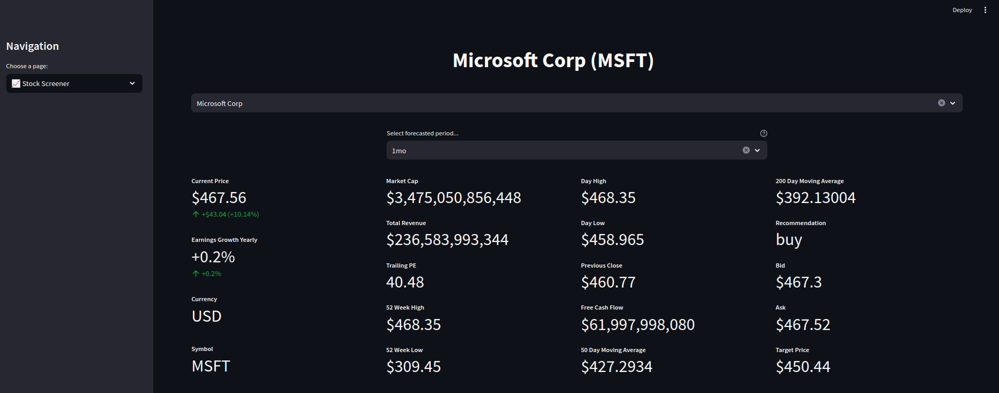
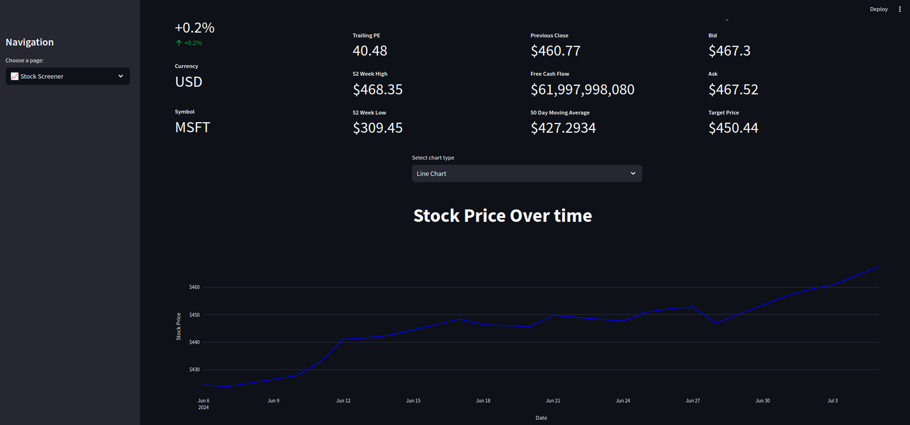
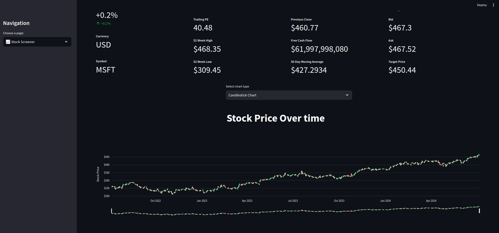
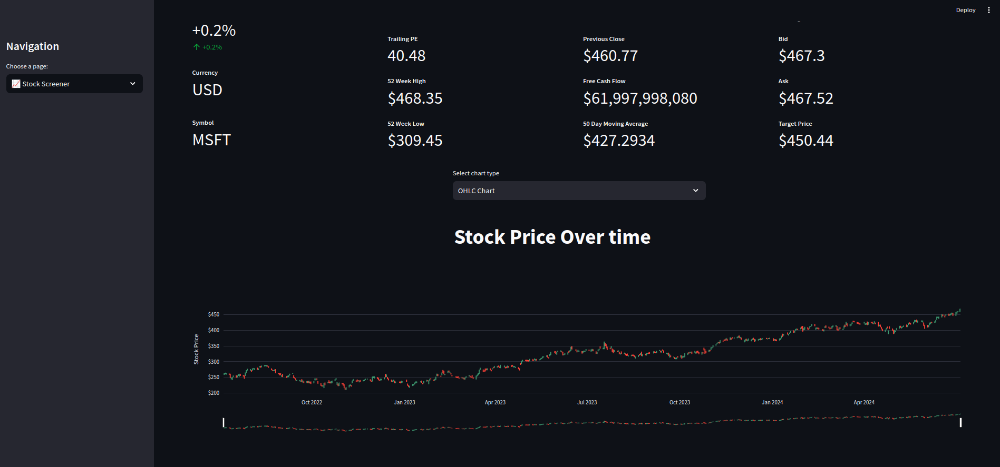
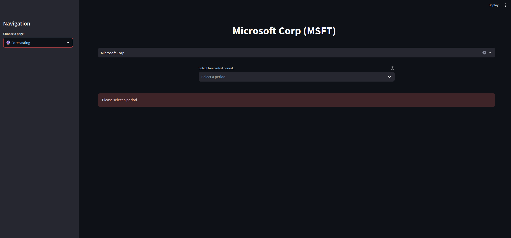
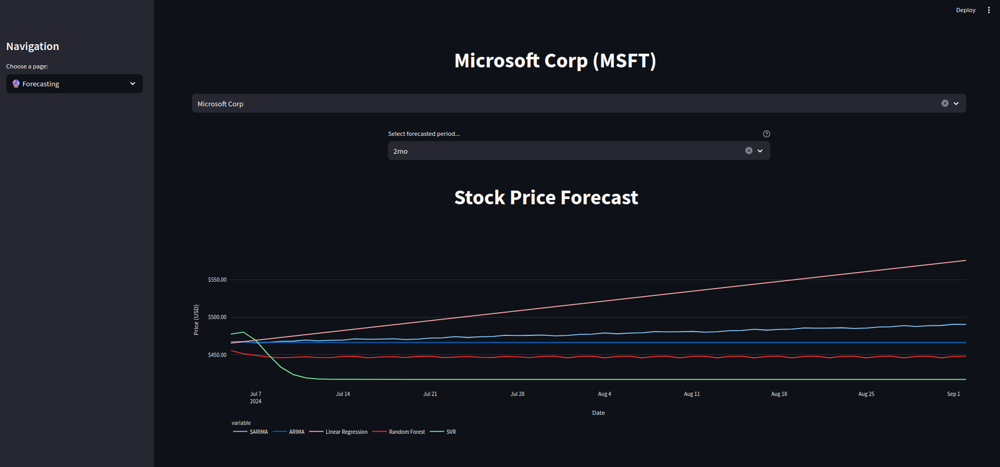
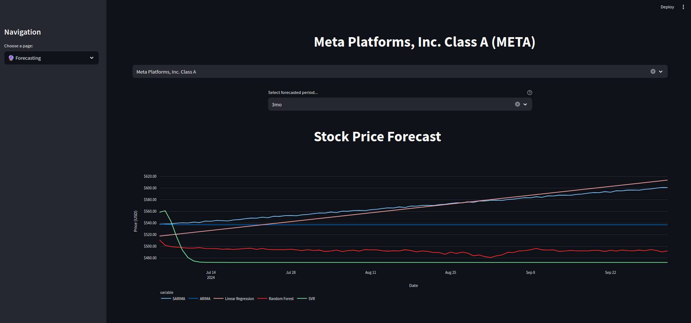
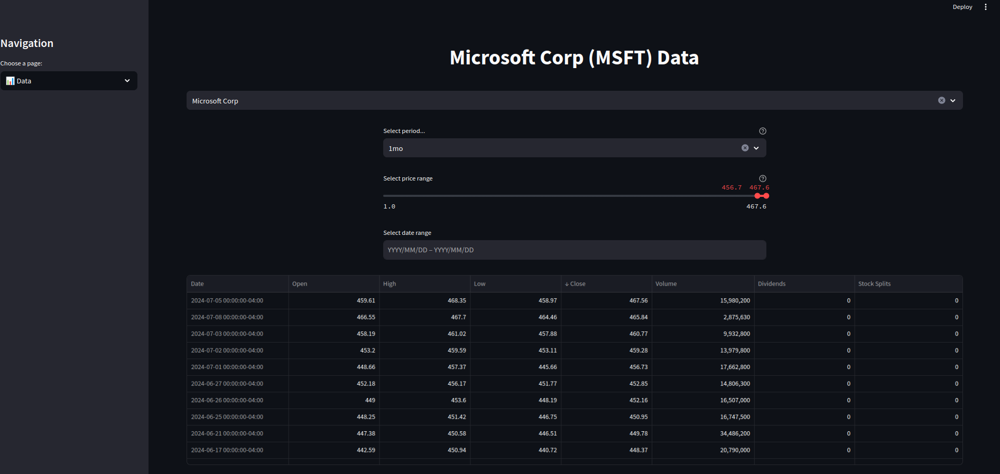

---------------
## Data Source

### Yahoo Finance Wrap API

The primary source of stock data, the YFinance Wrap API allows for the fetching of comprehensive stock data, including historical prices, volume, and market cap.

- **SP500 Data**: For SP500 stock symbols I utilized [SlickCharts](https://www.slickcharts.com/sp500).
- **YFinance**: Mainly for all the data [YFinance](https://github.com/ranaroussi/yfinance).
----

## Machine Learning
##### This project utilizes various machine learning algorithms to forecast stock prices. Below are brief descriptions and code snippets for each algorithm.

### Support Vector Regression (SVR)
* Support Vector Regression is used for predicting continuous values. It works well for our stock price forecasting.

```python
    model = SVR(kernel='rbf', C=1000.0, gamma=0.1)
    model.fit(time, close_prices.ravel())
    
    future_time = np.array(range(len(close_prices), len(close_prices) + 90)).reshape(-1, 1)
    forecast = model.predict(future_time)
```

### SARIMAX 
* SARIMAX stands for Seasonal AutoRegressive Integrated Moving Average with eXogenous regressors model. It's particularly useful for time series forecasting with seasonal components. (eXogenous variables were not used, meaning this model is actually behaving like SARIMA!)

```python
    model = sm.tsa.SARIMAX(close_prices, order=(1, 1, 1), seasonal_order=(1, 1, 1, 12), exog=None)
    # exog=None for SARIMA
    result = model.fit()
```

### ARIMA
* ARIMA, short for AutoRegressive Integrated Moving Average, is a popular model for time series forecasting without seasonal components.

```python
    model = sm.tsa.ARIMA(close_prices, order=(1, 1, 1))
    result = model.fit()
```

### Random Forest
* Random Forest is an ensemble learning method for regression that operates by constructing a multitude of decision trees at training time. 
  * The model is trained on historical data, then uses the last known data point to predict the next day's stock prices. This prediction becomes the new last known data point, and the process repeats for a specified number of future days (90 days in this case). This approach simulates a moving or "rolling" window of data that progresses one day at a time into the future.
```python 
    model = RandomForestRegressor()
    model.fit(X_train, y_train)
    
    last_known_features = X.iloc[-1].values.reshape(1, -1)
    
    predictions = []
    
    for _ in range(90):
        next_day_prediction = model.predict(last_known_features)
        predictions.append(next_day_prediction[0])
        
        last_known_features = np.array(next_day_prediction).reshape(1, -1)
    
    predictions_df = pd.DataFrame(predictions, columns=features)
```
----

### Linear Regression
* Lastly linear regression was also used.

### TODO
- [X] Implement Dashboard 
  - [X] stock screener page
  - [X] forecasting page
  - [X] data page
  - [ ] Add multiple stocks for comparison 
- [X] Use forecasting Machine Learning
  - [X] SARIMAX
  - [X] ARIMA
  - [X] Random Forest
  - [X] SVR
  - [X] Linear Regression
  - [ ] PyTorch LSTM
  - [ ] NN from scratch
- [X] Scraping
  - [X] Scrape SP500 companies
  - [X] Use YFinance for data